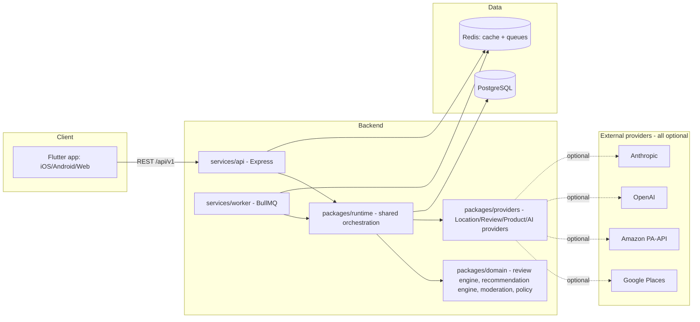
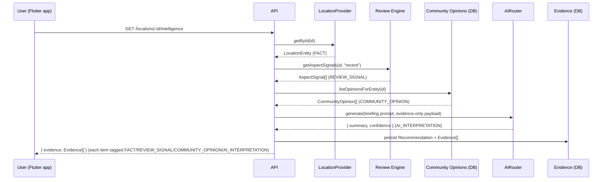

# LocaGuide Architecture

## System overview



Every arrow to `External` is optional: with no credentials configured, the
provider registry (`packages/runtime/src/registry.ts`) resolves every
provider to its mock implementation and the product runs fully in demo
mode - this is enforced by policy (`config/policies.yaml`), not by chance.

## Monorepo layout

```
locaguide/
├── apps/
│   ├── mobile/     Flutter client (Android/iOS/Web)
│   └── admin/      Admin console (currently: API-only, see apps/admin/README.md)
├── services/
│   ├── api/        Express REST API (auth, routes, health)
│   └── worker/     BullMQ background job processors
├── packages/
│   ├── contracts/  Shared Zod schemas/types - the wire contract between client, API, domain
│   ├── domain/     Pure business logic: review engine, recommendation engine, moderation, policy engine
│   ├── providers/  Provider-agnostic interfaces + mock/real adapters (location, review, product, AI)
│   ├── runtime/    Server-side composition: provider registry + Prisma-backed orchestration services
│   ├── db/         Prisma schema, migrations, generated client (shared by api + worker)
│   ├── config/     Env loading, AI routing config, policy config loaders
│   └── shared/     Logger, error types, id generation, data classification enum
├── infra/          Docker, Kubernetes, Helm, Terraform
└── docs/           This directory
```

`packages/domain` never imports `@locaguide/db` - it is pure, deterministic,
and unit-testable without a database (see `docs/testing.md`).
`packages/runtime` is the only place that combines domain logic with
Prisma and the provider registry, so both `services/api` (synchronous demo
path) and `services/worker` (async job path) share one implementation of
each business operation.

## Request lifecycle: the core briefing flow (section 2/3 of the product spec)



See `packages/domain/src/recommendationEngine/RecommendationEngine.ts` for
the deterministic rules that turn facts/signals/opinions into DO/CONSIDER/
WATCH/MUST_SEE/SPENDING/HEALTH_AWARE items, and
`packages/domain/src/recommendationEngine/prompts.ts` for the one place an
AI provider is invoked - only to phrase a short summary of evidence this
engine already computed, never to originate new facts (section 42,
Hallucination Control).

## Evidence model (section 8)

Every `Evidence` row (`packages/contracts/src/evidence.ts`) has a `type` of
exactly one of:

| type | meaning | example source |
|---|---|---|
| `FACT` | structured/provider data | opening hours, provider rating |
| `REVIEW_SIGNAL` | aggregated signal from many reviews | "42 of 94 recent reviews mention crowding" |
| `COMMUNITY_OPINION` | one user's submitted experience | a tip a LocaGuide user wrote |
| `AI_INTERPRETATION` | model-generated synthesis of the above | the one-paragraph briefing summary |

These are never blurred: the client is expected to render different
provenance UI per type, and the AI is contractually forbidden (via its
system prompt) from inventing anything not already present in the other
three categories.

## Async job architecture (section 25)

`services/worker` registers a BullMQ `Worker` per queue in
`services/worker/src/queues.ts`. Two are fully implemented (calling the
same `packages/runtime` functions the API uses synchronously for demo-scale
data): `review_analysis` and `recommendation_generation`. The rest
(`review_ingestion`, `product_sync`, `location_sync`, `ai_summary`,
`moderation`, `image_processing`, `analytics`, `notifications`) are
registered with a placeholder processor that logs a warning - each depends
on an external integration not available in this environment (a real
review-provider bulk export, object storage, a push-notification provider,
etc). Wiring one up is: implement the job body in `packages/runtime` (so
both API and worker can call it), then swap the placeholder processor in
`services/worker/src/index.ts`.

## Governance / policy engine (section 21)

`packages/domain/src/policy/PolicyEngine.ts` wraps `config/policies.yaml`
(loaded per-service, see `services/api/config/policies.yaml` and
`services/worker/config/policies.yaml`). It answers questions like "is
provider X allowed", "how many days of precise-location history may be
retained" (always 0 - see `docs/privacy.md`), and "what are the
moderation auto-hide thresholds" - application code calls these methods
rather than branching on raw config, so behavior stays centrally
configurable without code changes, including for future on-prem tenants
that need to disable specific external providers entirely.
